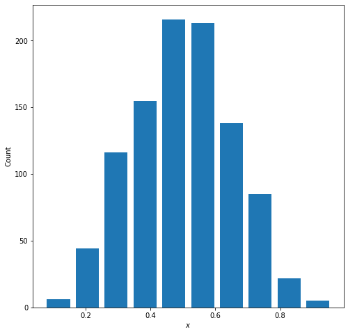

## 1 

**Describe continuous, ordinal and nominal data. Provide examples of each.**

Continuous data is numerical data that exists as a range of values. Common examples of continuous data are temperature, height, and grade percentage. 

Ordinal data is categorical data that has an inherent order. An example of ordinal data are rankings, like the order a group finishes a race, or the title of a person in a chain of command. 

Nominal data is categorical data that does not have in inherent order, like dates, color, or gender.

If I wanted to predict someone's income based off their gender and socioeconomic status, this would be an example of a model that includes all three types of data. The person's income would be numerical data, gender nominal data, and education ordinal data. 
My features are the variables I want to use as predictors, so they would be education and gender. My target would be what I am trying to predict, which would be a person's income. 

## 2 

A beta distribution is a probabilty distribution that measures the success of an outcome. Since, the beta distribution is a distribution of probabilities, all values within its domain will fall between 0 and 1. When the mean of a data set centers around 50%, this means there is an equal probability of successes as there is losses. When there is an equal probability for success as there is loss, the beta distribution follows a standard curve. The graph below is what a beta distribution with a mean of 0.5 of a random set of 1000 points looks like:

The variables $\alpha$ and $\beta$ describe the probabilities of success in the distribution. Within the beta distribution equation, **$alpha$-1** corresponds to the probability of success of an outcome and **$beta$-1** corresponds to the probability of failure of an outcome. As you increase the $\alpha$ value, the probability of success increases and the distribution shifts to the right (as pictured below)  

The mean and median of this plot approximate at 70% -- this is the $\alpha$ value I set the random distribution to.

On the other hand, if you increase the $\beta$ value, the probability of failure increases and the distribution shifts to the left (as pictured below) 

The mean and median of this plot approximate at 30% -- this is the $\alpha$ value I set the random distribution to. 

## 3 

### Histogram of raw data

(insert_image_here)

### Histogram of logdata
