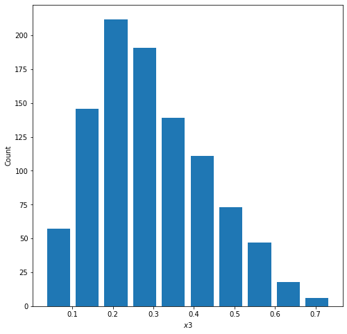
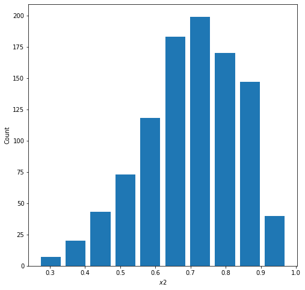
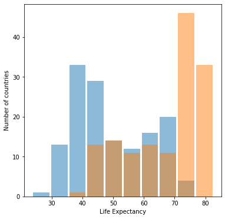
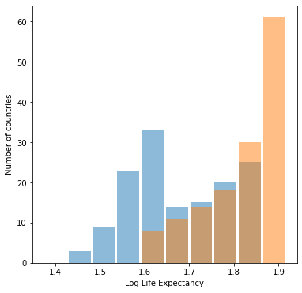
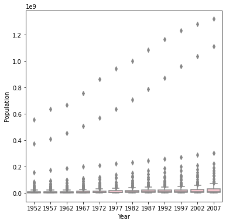
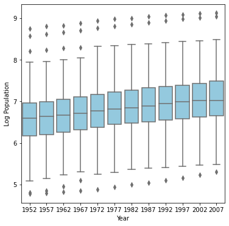

## 1 

**Describe continuous, ordinal and nominal data. Provide examples of each.**

Continuous data is numerical data that exists as a range of values. Common examples of continuous data are temperature, height, and grade percentage. 

Ordinal data is categorical data that has an inherent order. An example of ordinal data are rankings, like the order a group finishes a race, or the title of a person in a chain of command. 

Nominal data is categorical data that does not have in inherent order, like dates, color, or gender.

If I wanted to predict someone's income based off their gender and socioeconomic status, this would be an example of a model that includes all three types of data. The person's income would be numerical data, gender nominal data, and education ordinal data. 
My features are the variables I want to use as predictors, so they would be education and gender. My target would be what I am trying to predict, which would be a person's income. 

## 2 

A beta distribution is a probabilty distribution that measures the success of an outcome. Since, the beta distribution is a distribution of probabilities, all values within its domain will fall between 0 and 1. When the mean of a data set centers around 50%, this means there is an equal probability of successes as there is losses. When there is an equal probability for success as there is loss, the beta distribution follows a standard curve. The graph below is what a beta distribution with a mean of 0.5 of a random set of 1000 points looks like:

The variables $\alpha$ and $\beta$ describe the probabilities of success in the distribution. Within the beta distribution equation, **alpha-1** corresponds to the probability of success of an outcome and **beta-1** corresponds to the probability of failure of an outcome. As you increase the $\alpha$ value, the probability of success increases and the distribution shifts to the right (as pictured below)  

The mean and median of this plot approximate at 70% -- this is the alpha value I set the random distribution to.

On the other hand, if you increase the beta value, the probability of failure increases and the distribution shifts to the left (as pictured below) 

The mean and median of this plot approximate at 30% -- this is the alpha value I set the random distribution to. The beta value was set to 70 

## 3 

### Histogram of raw data

### Histogram of logdata

Both graphs look about the same, but the graph with raw data is more helpful. Log transformations are used when some portion of the data is much greater (or much smaller) than the rest of the data. This difference in size creates a not-so-helpful visual of the dataset, as the data is skewed by extraneous data points. When a log trsnsformation is performed, the focus shifts from the actual quantiy of the data point to the _difference in size of data points_, which tends to be a much smaller range than the original, skewed data set. A log transformation is unhelpful in this case becuase the data (life expectancy) already exists on a small scale (from about 0-100). The graphs then has no effect on this data and the graphs will look about the same before and after a log transformation. Even though they look the same, the graph for the inital transformation is more helpful becuase the axis are easier to interpret.

## 4 

Box plot of Population

Box plot of Logarithmic Population

The box-and-whiskers plot after th logarithmic transformation of population best communicates the change in population from 1952 to 2007. Since population in this data set is being skewed by countries with much larger populations than the others, a log transformation is helpful in this scenario. In the first set of boxplots, the range of the y axis makes it difficult to parse out individual plots. However, when we reduced the range of the y axis using a log transformation, the plots became much more readable. From the second plot we can spot an upward trend in population throughout the years, most noticeable by the increase in median from 1952 to 2007. 
